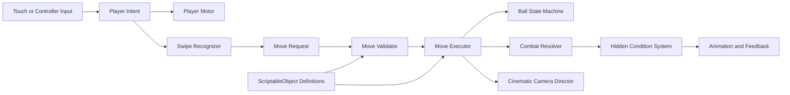

# Flash Bang — Unity/C# Project Handoff

**Document purpose:** Source of truth for continuing the Flash Bang game in Claude, Codex, or with a Unity development team.  
**Status:** Pre-production and vertical-slice specification.  
**Important:** All C# in this document is **starter scaffolding**, not a complete, production-ready game.

---

## 1. Project Summary

**Flash Bang** is an original third-person action game designed first for mobile devices held sideways (landscape). Players create a fighter, equip a smooth glowing ball, learn drawn swipe patterns, catch incoming balls with timing and skill, and execute cinematic powers involving martial arts, elements, dragons, teleportation, and large-scale finishers.

The basic loop is:

> **Study → Train → Battle → Earn rewards → Upgrade → Fight stronger opponents**

The first playable release should prove that these three actions are fun:

1. Moving a character in third person.
2. Drawing and recognizing a move pattern.
3. Throwing, catching, and countering with the equipped ball.

Do not build all 400 moves, every mode, or large-scale multiplayer before this loop works.

---

## 2. Instructions for Any AI or Developer

- Read this document completely before changing the project.
- Treat sections marked **LOCKED** as final unless the creator specifically asks to revise them.
- Change only what is requested; do not redesign unrelated approved screens.
- Keep Flash Bang original. Do not copy characters, outfits, symbols, exact powers, dialogue, music, UI, or camera sequences from existing games, anime, films, or sports franchises.
- Preserve player customization in gameplay and cinematics.
- Use original or properly licensed music, voices, art, and animation.
- Prefer data-driven systems. New moves, balls, and powers should usually be added as assets, not new hard-coded branches.
- Keep prototypes small and testable.
- When presenting visual work, show the requested result rather than only describing it.

---

# Part I — Locked Product Design

## 3. Camera and Presentation — LOCKED

- Normal gameplay uses a third-person camera behind the player.
- Mobile gameplay is landscape/sideways.
- The normal camera is not first person and not a close-up.
- During major moves, the game may temporarily take over the camera for a short cinematic.
- Cinematics may use close-ups, orbiting shots, wide shots, slow motion, and impact shots.
- After the move, control and the camera return smoothly behind the player.
- Common moves should use short camera accents. Only rare finishers should use longer cinematics.
- The equipped player character, suit, ball, power colors, and voice must appear correctly in live cinematics.

## 4. Battle HUD — LOCKED

Normal battles must not show:

- Health bars
- Damage numbers
- Score clutter
- Floating player names
- Ability buttons down the side
- Player portraits in screen corners
- Move names or hit counters covering cinematic action

The screen normally shows the world, player, opponents, teammates when applicable, and movement control. Context-only feedback such as the catch meter may appear briefly when required.

Damage still exists internally. Communicate condition through animation and effects:

- Strong: upright posture, clean movement, normal breathing.
- Weakened: slower recovery, heavy breathing, dust or clothing wear, guarded posture.
- Critical: stumble, one-knee recovery, brief blur, weaker catches.
- Knockout: a decisive clean defeat with no graphic gore.

## 5. Official Home Screen — LOCKED

The official home uses the approved dark/purple cinematic style.

Top navigation:

- Home
- Play
- Study
- Characters
- Settings
- Friends
- Legendary Shop

Left stacked cards:

- Play
- Ranked Arena
- Story Mode
- Events
- Training

Center:

- Large equipped player character
- Glowing platform
- Dark futuristic/cosmic city atmosphere

Bottom navigation:

- Powers
- Ball
- Dragons
- Loadout
- Achievements
- Missions
- Leaderboard

Do not add daily reward wheels, free chests, season advertisements, or a crowded right-side promotion column.

## 6. Study Book — LOCKED

- Study appears as a giant, old, legendary book filling most of the landscape screen.
- The front cover says **FLASH BANG**.
- Pages are aged and textured but remain easy to read.
- Each spread contains many useful details rather than a tiny lesson card.
- Small page numbers appear in the bottom-left and bottom-right corners.
- Large left and right page-turn controls navigate the book.
- The design can support about 400 authored moves.
- Swipe diagrams show the actual path or stroke, including curves, rather than relying only on small arrow icons.

Pattern length must be data-driven. The current design supports short beginner patterns and longer advanced patterns, up to approximately ten strokes. Do not hard-code a single length into the recognizer. If the creator later locks every competitive move to six strokes, that should be a content rule in move data rather than an engine limitation.

## 7. Training — LOCKED

- Full-screen, bright daytime practice arena.
- No top, bottom, or right-side menu clutter.
- Show the player, equipped ball, training robot, white tutorial hand, and only essential instruction text.
- Training robot: dark smooth human-shaped armor, simple face, orange target circle on chest, no random weapons or bulky parts.
- The tutorial hand demonstrates a path, stops, and waits for the player to copy it.
- For secret moves, the hand is smaller and higher above the character so it does not block the fighter.
- Instruction wording:
  - **Swipe in the same directions as the arrows.**
  - **Follow the arrows in order.**
  - **Your turn. Repeat the same swipe pattern.**

## 8. Character Collection — LOCKED

Main collection tabs:

- Balls
- Powers
- Moves
- Suits
- Voice

Layout:

- Large scrollable collection grid on the left/center.
- One full-body character on a clean stage on the right where appropriate.
- Nothing blocks the character.
- Do not show unwanted labels such as Legend, Shadow, level circles, Awaken, Info, Skills, Gear, or Custom over the character.

Voice page:

- No character is required.
- Colorful cards rather than only black cards: blue, red, rainbow, gold, silver, purple, and other themes.
- Each card may preview the same test line in a different original human-sounding voice.
- Player can preview and equip a voice.
- Example test line: **“I don’t follow the shadows… I become them.”**
- Never imitate a real celebrity without permission.

## 9. Balls — LOCKED

- Balls are clean, smooth, round energy orbs.
- No basketball lines or sports-ball seams.
- Balls can use solid colors, mixed colors, glow, particles, and elemental materials.
- The exact equipped ball must appear in catching, throwing, moves, replays, and cinematics.

Examples: Fire, Ice, Shadow, Lightning, Cosmic, Gold, Neon, Water, Poison, and Key Ball.

## 10. Powers and Combining Powers — LOCKED

Players may:

- Create an original starting power.
- Choose starting powers.
- Combine two, three, or four powers maximum.
- Preview the new combined power and its cost.
- Buy combinations with earnable coins.
- Sell unwanted or duplicate powers for fewer coins than their original value.
- Lock favorites to prevent accidental sale.

Power combinations change options, visuals, and move synergies, but do not automatically win battles. Swipe skill, timing, counters, range, recovery, and matchup rules still matter.

## 11. Catch System — LOCKED

When a catchable ball is about to arrive, a curved timing meter appears briefly. A marker moves across red, yellow, and green zones. The player taps to stop it.

- **Green — Perfect Catch:** clean catch, may trigger a one-hand animation, fast counter window.
- **Yellow — Risk Catch:** juggle or almost-drop animation, slower recovery, ball still secured.
- **Red — Miss:** ball escapes or hits the player. A very small, move-dependent emergency catch may be possible.

Difficulty changes the size and speed of the zones:

- Easy throw: larger green zone.
- Fast or advanced throw: smaller green zone.
- Legendary throw: very small green zone and faster marker.

The meter must not become permanent HUD clutter. It appears only during the catch decision.

## 12. Combat Content

Core move families include:

- Physical: Round Kick, Reverse Round Kick, Sky Spin Kick, Low Leg Sweep, Rising Face Kick, Double Side Face Kick.
- Ball: throw, ground slam, curve throw, return, Ball Barrage.
- Mobility: dash, dodge, teleportation.
- Elements: fire, water, ice, lightning, wind, poison, earth, light, shadow, cosmic.
- Dragons: summons, throws, counters, and finishers.
- Secret moves: harder inputs and large cinematic payoff.

No graphic dismemberment or blood is required. Powerful attacks end in clean knockouts, energy dissolves, smoke, light, impact waves, or other non-graphic defeat effects.

## 13. Story and Modes

Story structure:

- Player discovers the mysterious ball.
- Flashy appears and teaches the world.
- Good Flashy and Dark Flashy become part of the conflict.
- The Study Book teaches moves.
- A nearly invisible dot in the home-screen background may unlock the Secret Book.
- The Key Move leads to the Key Holder ending.
- The game ends with credits and a Part Two message while allowing continued play and additional accounts.

Story presentation:

> **Cinematic intro → playable mission → boss battle → cinematic ending**

Modes:

- Quick Play
- Ranked Arena
- Story Mode
- Training
- Events
- 1v1, 2v2, 4v4, 6v6, and 8v8 as long-term modes

Build 1v1 first. Larger team modes are later milestones.

Quick Play matchmaking presentation:

- Local player remains fixed on one side.
- Opponent cards rapidly cycle, slow down, and stop on the selected opponent.
- Show **Searching**, then **Match Found**, then **Preparing Battle**.

---

# Part II — Unity Technical Direction

## 14. Recommended Foundation

Use:

- The current supported Unity LTS selected at project start, pinned for the whole team.
- C#.
- Universal Render Pipeline for a scalable mobile-first visual target.
- Unity Input System for touch, controller, keyboard, and future platform support.
- Cinemachine for third-person and move cameras.
- Timeline for story cinematics.
- Animator state machines initially; evaluate a more advanced animation solution only after the slice works.
- Addressables later for large collections of moves, balls, characters, and downloadable content.
- Git with text serialization and visible meta files.

Recommended project settings:

- Force landscape orientation for the mobile prototype.
- Use the new Input System.
- Set asset serialization to **Force Text**.
- Set version control mode to **Visible Meta Files**.
- Establish a target frame rate appropriate to the test device; profile instead of assuming.

## 15. Recommended Project Structure

```text
Assets/
  FlashBang/
    Art/
      Animations/
      Characters/
      Environments/
      FX/
      Materials/
      UI/
    Audio/
      Music/
      SFX/
      Voices/
    Data/
      Balls/
      Characters/
      GameModes/
      Moves/
      Powers/
      Progression/
    Prefabs/
      Characters/
      Combat/
      Environment/
      UI/
    Scenes/
      Bootstrap.unity
      Home.unity
      Training.unity
      Arena_Prototype.unity
      Story_Chapter01.unity
    Scripts/
      Core/
      Input/
      Player/
      Combat/
      Ball/
      Moves/
      Catching/
      Camera/
      UI/
      Progression/
      Save/
      Modes/
      Networking/
      Tests/
    Settings/
    Tests/
      EditMode/
      PlayMode/
```

Assembly definitions are recommended once the project grows:

```text
FlashBang.Core
FlashBang.Gameplay
FlashBang.UI
FlashBang.Editor
FlashBang.Tests
```

Avoid creating too many assemblies on day one. Start with Core, Gameplay, UI, and Tests.

## 16. Runtime Architecture

Keep gameplay systems separate from presentation.



Suggested responsibilities:

- `PlayerInputRouter`: converts device input into neutral gameplay intent.
- `ThirdPersonMotor`: movement, facing, jumping, and grounded state.
- `SwipeCapture`: records touch/mouse paths.
- `SwipeRecognizer`: converts paths into normalized strokes and compares patterns.
- `MoveLoadout`: identifies moves the player is allowed to use.
- `MoveValidator`: checks pattern, state, cooldown, range, and ball requirements.
- `MoveExecutor`: coordinates animation, ball behavior, effects, hit windows, and cameras.
- `BallController`: owns ball state and legal transitions.
- `CatchTimingController`: runs the temporary red/yellow/green decision.
- `CombatResolver`: resolves hits and condition changes without UI health bars.
- `ConditionPresenter`: updates posture, breathing, clothing wear, camera response, and knockout.
- `GameModeController`: owns match rules without changing low-level combat.
- `SaveService`: persists IDs and progress, not scene objects.

---

# Part III — Data Models and ScriptableObjects

## 17. Core Enums and Serializable Types

> **Scaffolding only:** Names and fields will evolve during implementation.

```csharp
namespace FlashBang.Gameplay
{
    public enum MoveCategory
    {
        Physical,
        Ball,
        Catch,
        Mobility,
        Elemental,
        Dragon,
        Secret,
        Ultimate
    }

    public enum MoveRequirement
    {
        None,
        BallEquipped,
        BallHeld,
        IncomingBall,
        Grounded,
        Airborne
    }

    public enum BallState
    {
        Holstered,
        Held,
        Thrown,
        CatchWindow,
        Caught,
        Loose,
        ResolvingMove,
        Disabled
    }

    public enum CatchResult
    {
        None,
        Perfect,
        Risk,
        Miss,
        Emergency
    }

    public enum ConditionTier
    {
        Strong,
        Weakened,
        Critical,
        KnockedOut
    }

    public enum PatternMatchGrade
    {
        Failed,
        Good,
        Perfect
    }
}
```

## 18. Move Definition

Each move should be an asset. Do not create a unique MonoBehaviour subclass for every move.

```csharp
using System;
using System.Collections.Generic;
using UnityEngine;

namespace FlashBang.Gameplay
{
    [CreateAssetMenu(menuName = "Flash Bang/Move Definition")]
    public sealed class MoveDefinition : ScriptableObject
    {
        [Header("Identity")]
        public string id;
        public string displayName;
        [TextArea] public string description;
        public MoveCategory category;

        [Header("Input")]
        public SwipePattern pattern;
        [Range(0f, 1f)] public float minimumMatchScore = 0.78f;

        [Header("Rules")]
        public MoveRequirement requirement;
        public float cooldownSeconds = 1f;
        public float range = 3f;
        public bool catchable = true;

        [Header("Resolution")]
        public float conditionDamage = 10f;
        public float knockback = 3f;
        public AnimationClip animationClip;
        public GameObject effectPrefab;
        public CinematicProfile cinematic;

        [Header("Progression")]
        public int coinCost;
        public bool secret;
    }

    [Serializable]
    public sealed class SwipePattern
    {
        public List<SwipeStrokeTemplate> strokes = new();
    }

    [Serializable]
    public sealed class SwipeStrokeTemplate
    {
        public List<Vector2> normalizedPoints = new();
        [Min(0f)] public float minimumDuration;
        [Min(0f)] public float maximumDuration = 2f;
    }

    [Serializable]
    public sealed class CinematicProfile
    {
        public bool enabled;
        public string cameraSequenceId;
        public float maximumDuration = 2f;
    }
}
```

Production notes:

- Generate stable IDs with an editor tool; do not rely on asset names.
- Store animation event timing in reusable execution data rather than scattering magic delays in code.
- Pattern assets should support both straight and curved paths.
- A move may reference a reusable execution recipe such as melee hit, projectile, teleport, summon, or area blast.

## 19. Ball and Power Definitions

```csharp
using UnityEngine;

namespace FlashBang.Gameplay
{
    [CreateAssetMenu(menuName = "Flash Bang/Ball Definition")]
    public sealed class BallDefinition : ScriptableObject
    {
        public string id;
        public string displayName;
        public GameObject prefab;
        public Material material;
        public float throwSpeed = 18f;
        public float catchDifficulty = 0.5f;
        public int coinCost;
    }

    [CreateAssetMenu(menuName = "Flash Bang/Power Definition")]
    public sealed class PowerDefinition : ScriptableObject
    {
        public string id;
        public string displayName;
        public Color primaryColor = Color.white;
        public GameObject auraPrefab;
        public int buyPrice;
        public int sellPrice;
        [Range(1, 4)] public int combinationWeight = 1;
    }
}
```

Combined powers should save references to source power IDs plus a generated combination ID. Final balance values should come from a deterministic recipe owned by the game, not arbitrary client values.

---

# Part IV — Input and Swipe Recognition

## 20. Swipe Recognition Goals

The recognizer must support:

- Mouse input in the Editor.
- Touch input on mobile.
- One or more strokes per move.
- Straight lines, diagonals, curves, loops, and mirrored patterns.
- Variable pattern length.
- Position and screen-size independence.
- Tolerance without accepting unrelated scribbles.
- Timing requirements for selected advanced moves.

Do not compare raw screen pixels directly. Normalize every stroke:

1. Capture points at a minimum spacing.
2. Remove tiny accidental movement.
3. Resample the path to a fixed number of points.
4. Translate it to a common origin.
5. Scale it into a unit box while preserving aspect ratio as needed.
6. Optionally rotate only when a move is meant to be rotation-independent. Most directional combat moves should not rotate freely.
7. Compare it with authored templates.

## 21. Swipe Capture Scaffolding

```csharp
using System;
using System.Collections.Generic;
using UnityEngine;
using UnityEngine.EventSystems;

namespace FlashBang.Input
{
    public sealed class SwipeCapture : MonoBehaviour,
        IPointerDownHandler, IDragHandler, IPointerUpHandler
    {
        [SerializeField] private float minimumPointDistance = 8f;

        public event Action<IReadOnlyList<Vector2>, float> StrokeCompleted;

        private readonly List<Vector2> points = new();
        private float startedAt;

        public void OnPointerDown(PointerEventData eventData)
        {
            points.Clear();
            points.Add(eventData.position);
            startedAt = Time.unscaledTime;
        }

        public void OnDrag(PointerEventData eventData)
        {
            if (points.Count == 0 ||
                Vector2.Distance(points[^1], eventData.position) >= minimumPointDistance)
            {
                points.Add(eventData.position);
            }
        }

        public void OnPointerUp(PointerEventData eventData)
        {
            if (points.Count == 0) return;

            points.Add(eventData.position);
            float duration = Time.unscaledTime - startedAt;
            StrokeCompleted?.Invoke(points.ToArray(), duration);
            points.Clear();
        }
    }
}
```

This component only captures a single stroke. A separate `SwipeSequenceBuffer` should group strokes until:

- The expected number is reached.
- The player confirms.
- A short inter-stroke timeout expires.
- The move is canceled.

## 22. Path Normalization Scaffolding

```csharp
using System.Collections.Generic;
using UnityEngine;

namespace FlashBang.Input
{
    public static class SwipePathUtility
    {
        public static List<Vector2> Normalize(
            IReadOnlyList<Vector2> source,
            int sampleCount = 32)
        {
            var sampled = Resample(source, sampleCount);
            if (sampled.Count == 0) return sampled;

            Rect bounds = GetBounds(sampled);
            float scale = Mathf.Max(bounds.width, bounds.height, 0.0001f);
            Vector2 center = bounds.center;

            for (int i = 0; i < sampled.Count; i++)
                sampled[i] = (sampled[i] - center) / scale;

            return sampled;
        }

        public static float Similarity(
            IReadOnlyList<Vector2> a,
            IReadOnlyList<Vector2> b)
        {
            if (a.Count == 0 || a.Count != b.Count) return 0f;

            float total = 0f;
            for (int i = 0; i < a.Count; i++)
                total += Vector2.Distance(a[i], b[i]);

            float averageDistance = total / a.Count;
            return Mathf.Clamp01(1f - averageDistance);
        }

        private static List<Vector2> Resample(
            IReadOnlyList<Vector2> source,
            int count)
        {
            var result = new List<Vector2>(count);
            if (source == null || source.Count == 0 || count <= 0) return result;
            if (source.Count == 1)
            {
                for (int i = 0; i < count; i++) result.Add(source[0]);
                return result;
            }

            float length = 0f;
            for (int i = 1; i < source.Count; i++)
                length += Vector2.Distance(source[i - 1], source[i]);

            float step = length / Mathf.Max(1, count - 1);
            result.Add(source[0]);

            float walked = 0f;
            int segment = 1;
            Vector2 previous = source[0];

            while (result.Count < count - 1 && segment < source.Count)
            {
                Vector2 current = source[segment];
                float distance = Vector2.Distance(previous, current);

                if (walked + distance >= step && distance > 0f)
                {
                    float t = (step - walked) / distance;
                    previous = Vector2.Lerp(previous, current, t);
                    result.Add(previous);
                    walked = 0f;
                }
                else
                {
                    walked += distance;
                    previous = current;
                    segment++;
                }
            }

            result.Add(source[^1]);
            while (result.Count < count) result.Add(source[^1]);
            return result;
        }

        private static Rect GetBounds(IReadOnlyList<Vector2> points)
        {
            float minX = points[0].x, maxX = points[0].x;
            float minY = points[0].y, maxY = points[0].y;

            for (int i = 1; i < points.Count; i++)
            {
                minX = Mathf.Min(minX, points[i].x);
                maxX = Mathf.Max(maxX, points[i].x);
                minY = Mathf.Min(minY, points[i].y);
                maxY = Mathf.Max(maxY, points[i].y);
            }

            return Rect.MinMaxRect(minX, minY, maxX, maxY);
        }
    }
}
```

This simple distance matcher is enough for an early experiment, not final competitive play. A production recognizer should add:

- Stroke count and order validation.
- Start/end direction weighting.
- Curvature and corner comparison.
- Mirroring rules.
- Duration and pause scoring.
- False-positive testing using real player recordings.
- Accessibility tolerances.
- Device-independent thresholds.

## 23. Move Recognition Service Scaffolding

```csharp
using System.Collections.Generic;
using FlashBang.Gameplay;

namespace FlashBang.Input
{
    public sealed class SwipeRecognizer
    {
        public (MoveDefinition move, float score) FindBestMatch(
            IReadOnlyList<IReadOnlyList<UnityEngine.Vector2>> captured,
            IReadOnlyList<MoveDefinition> candidates)
        {
            MoveDefinition best = null;
            float bestScore = 0f;

            foreach (MoveDefinition move in candidates)
            {
                if (move == null || move.pattern == null) continue;
                if (move.pattern.strokes.Count != captured.Count) continue;

                float total = 0f;
                bool valid = true;

                for (int i = 0; i < captured.Count; i++)
                {
                    var input = SwipePathUtility.Normalize(captured[i]);
                    var template = SwipePathUtility.Normalize(
                        move.pattern.strokes[i].normalizedPoints);

                    float score = SwipePathUtility.Similarity(input, template);
                    if (score < move.minimumMatchScore)
                    {
                        valid = false;
                        break;
                    }
                    total += score;
                }

                if (!valid) continue;
                float average = total / captured.Count;
                if (average > bestScore)
                {
                    best = move;
                    bestScore = average;
                }
            }

            return (best, bestScore);
        }
    }
}
```

---

# Part V — Player, Ball, Catch, and Combat

## 24. Third-Person Player Controller Scaffolding

Use the Input System to produce a `Vector2 Move` and a jump intent. The motor should not know whether input came from a virtual joystick, keyboard, or controller.

```csharp
using UnityEngine;

namespace FlashBang.Player
{
    [RequireComponent(typeof(CharacterController))]
    public sealed class ThirdPersonMotor : MonoBehaviour
    {
        [SerializeField] private Transform cameraTransform;
        [SerializeField] private float moveSpeed = 6f;
        [SerializeField] private float rotationSpeed = 12f;
        [SerializeField] private float gravity = -22f;
        [SerializeField] private float jumpHeight = 1.4f;

        private CharacterController controller;
        private Vector2 moveInput;
        private float verticalVelocity;
        private bool jumpQueued;
        private bool controlsLocked;

        private void Awake() => controller = GetComponent<CharacterController>();

        public void SetMoveInput(Vector2 value) => moveInput = value;
        public void QueueJump() => jumpQueued = true;
        public void SetControlsLocked(bool locked) => controlsLocked = locked;

        private void Update()
        {
            if (controlsLocked)
            {
                ApplyGravity();
                return;
            }

            Vector3 forward = Vector3.ProjectOnPlane(cameraTransform.forward, Vector3.up).normalized;
            Vector3 right = Vector3.ProjectOnPlane(cameraTransform.right, Vector3.up).normalized;
            Vector3 desired = forward * moveInput.y + right * moveInput.x;

            if (desired.sqrMagnitude > 0.01f)
            {
                desired.Normalize();
                transform.forward = Vector3.Slerp(
                    transform.forward,
                    desired,
                    rotationSpeed * Time.deltaTime);
            }

            if (controller.isGrounded && verticalVelocity < 0f)
                verticalVelocity = -2f;

            if (jumpQueued && controller.isGrounded)
                verticalVelocity = Mathf.Sqrt(jumpHeight * -2f * gravity);

            jumpQueued = false;
            verticalVelocity += gravity * Time.deltaTime;

            Vector3 velocity = desired * moveSpeed;
            velocity.y = verticalVelocity;
            controller.Move(velocity * Time.deltaTime);
        }

        private void ApplyGravity()
        {
            verticalVelocity += gravity * Time.deltaTime;
            controller.Move(Vector3.up * verticalVelocity * Time.deltaTime);
        }
    }
}
```

Production additions:

- Ground slope handling.
- Dodge and slide states.
- Root-motion coordination for combat animations.
- Network-friendly movement intent.
- State-based movement restrictions.
- Camera collision and aim mode.
- Animation parameter driver.

## 25. Ball State Machine

Legal ball flow:

```text
Holstered → Held → Thrown → CatchWindow
CatchWindow → Caught → Held
CatchWindow → Loose
Thrown → ResolvingMove → Holstered/Loose
Any controlled state → Disabled during reset or knockout
```

Do not allow arbitrary state changes. Use one authority that validates transitions.

```csharp
using System;
using UnityEngine;

namespace FlashBang.Gameplay
{
    public sealed class BallController : MonoBehaviour
    {
        public BallState State { get; private set; } = BallState.Holstered;
        public Transform Owner { get; private set; }

        public event Action<BallState> StateChanged;

        public bool TryTransition(BallState next, Transform owner = null)
        {
            if (!IsLegal(State, next)) return false;

            State = next;
            Owner = owner;
            StateChanged?.Invoke(State);
            return true;
        }

        private static bool IsLegal(BallState from, BallState to) => (from, to) switch
        {
            (BallState.Holstered, BallState.Held) => true,
            (BallState.Held, BallState.Thrown) => true,
            (BallState.Thrown, BallState.CatchWindow) => true,
            (BallState.CatchWindow, BallState.Caught) => true,
            (BallState.Caught, BallState.Held) => true,
            (BallState.CatchWindow, BallState.Loose) => true,
            (BallState.Thrown, BallState.ResolvingMove) => true,
            (BallState.ResolvingMove, BallState.Holstered) => true,
            (BallState.ResolvingMove, BallState.Loose) => true,
            (_, BallState.Disabled) => true,
            (BallState.Disabled, BallState.Holstered) => true,
            _ => false
        };
    }
}
```

## 26. Throw/Catch Flow

Recommended sequence:

1. Attacker requests a throw move.
2. `MoveValidator` checks the move, state, equipped ball, cooldown, and target.
3. Animation begins.
4. An animation event releases the ball.
5. Ball changes from `Held` to `Thrown`.
6. Ball trajectory predicts when it enters the defender’s catch opportunity volume.
7. If the attack is catchable, the server or local authority opens a catch window.
8. Catch meter appears for that defender only.
9. Defender taps; `CatchTimingController` resolves the zone.
10. Perfect/Risk/Emergency attaches the actual ball to the hand socket and plays the correct animation.
11. Miss resolves the attack or loose-ball behavior.
12. On a successful catch, a limited counter window opens.

## 27. Catch Timing Meter Scaffolding

```csharp
using System;
using UnityEngine;

namespace FlashBang.Catching
{
    public sealed class CatchTimingController : MonoBehaviour
    {
        [SerializeField] private AnimationCurve markerMotion =
            AnimationCurve.Linear(0f, 0f, 1f, 1f);

        public event Action<FlashBang.Gameplay.CatchResult> Resolved;

        private CatchWindowConfig config;
        private float openedAt;
        private bool active;

        public float NormalizedMarker { get; private set; }

        public void Open(CatchWindowConfig value)
        {
            config = value;
            openedAt = Time.unscaledTime;
            active = true;
            gameObject.SetActive(true);
        }

        private void Update()
        {
            if (!active) return;

            float elapsed = Time.unscaledTime - openedAt;
            float phase = Mathf.PingPong(elapsed * config.cyclesPerSecond, 1f);
            NormalizedMarker = markerMotion.Evaluate(phase);

            if (elapsed >= config.maximumDuration)
                Resolve(FlashBang.Gameplay.CatchResult.Miss);
        }

        public void StopMarker()
        {
            if (!active) return;

            var result = config.Evaluate(NormalizedMarker);
            Resolve(result);
        }

        private void Resolve(FlashBang.Gameplay.CatchResult result)
        {
            active = false;
            Resolved?.Invoke(result);
            gameObject.SetActive(false);
        }
    }

    [Serializable]
    public struct CatchWindowConfig
    {
        [Range(0f, 1f)] public float greenStart;
        [Range(0f, 1f)] public float greenEnd;
        [Range(0f, 1f)] public float yellowPadding;
        public float cyclesPerSecond;
        public float maximumDuration;
        [Range(0f, 1f)] public float emergencyChance;

        public FlashBang.Gameplay.CatchResult Evaluate(float marker)
        {
            if (marker >= greenStart && marker <= greenEnd)
                return FlashBang.Gameplay.CatchResult.Perfect;

            bool yellow = marker >= greenStart - yellowPadding &&
                          marker <= greenEnd + yellowPadding;
            if (yellow) return FlashBang.Gameplay.CatchResult.Risk;

            return UnityEngine.Random.value <= emergencyChance
                ? FlashBang.Gameplay.CatchResult.Emergency
                : FlashBang.Gameplay.CatchResult.Miss;
        }
    }
}
```

For competitive multiplayer, do not use unsynchronized `UnityEngine.Random` to decide an emergency catch. The authoritative simulation must use a deterministic seed or server result.

## 28. Hidden Condition and Knockout Scaffolding

```csharp
using System;
using UnityEngine;

namespace FlashBang.Combat
{
    public sealed class FighterCondition : MonoBehaviour
    {
        [SerializeField] private float maximumCondition = 100f;
        [SerializeField] private float weakenedThreshold = 60f;
        [SerializeField] private float criticalThreshold = 25f;

        public float Current { get; private set; }
        public FlashBang.Gameplay.ConditionTier Tier { get; private set; }

        public event Action<FlashBang.Gameplay.ConditionTier> TierChanged;
        public event Action KnockedOut;

        private void Awake()
        {
            Current = maximumCondition;
            SetTier(FlashBang.Gameplay.ConditionTier.Strong);
        }

        public void ApplyConditionDamage(float amount)
        {
            if (Tier == FlashBang.Gameplay.ConditionTier.KnockedOut) return;

            Current = Mathf.Max(0f, Current - Mathf.Max(0f, amount));

            if (Current <= 0f)
            {
                SetTier(FlashBang.Gameplay.ConditionTier.KnockedOut);
                KnockedOut?.Invoke();
            }
            else if (Current <= criticalThreshold)
                SetTier(FlashBang.Gameplay.ConditionTier.Critical);
            else if (Current <= weakenedThreshold)
                SetTier(FlashBang.Gameplay.ConditionTier.Weakened);
            else
                SetTier(FlashBang.Gameplay.ConditionTier.Strong);
        }

        private void SetTier(FlashBang.Gameplay.ConditionTier next)
        {
            if (Tier == next) return;
            Tier = next;
            TierChanged?.Invoke(Tier);
        }
    }
}
```

Condition is intentionally hidden from the normal HUD. Debug builds should have an optional developer overlay so designers can tune balance.

---

# Part VI — Move Execution and Cameras

## 29. Move Validation

A move is valid only if:

- The pattern matches an owned and equipped move.
- The fighter is not knocked out or already locked in an incompatible state.
- Required ball state is satisfied.
- Grounded/airborne requirement is satisfied.
- Cooldown is ready.
- Target and range are valid.
- The current mode allows the move.

Never let UI code execute gameplay directly. UI and gesture input should submit a request to the validator.

## 30. Move Executor Scaffolding

```csharp
using System.Collections;
using UnityEngine;

namespace FlashBang.Gameplay
{
    public sealed class MoveExecutor : MonoBehaviour
    {
        [SerializeField] private Animator animator;
        [SerializeField] private Transform effectOrigin;
        [SerializeField] private FlashBang.Player.ThirdPersonMotor motor;

        private bool busy;

        public bool CanExecute(MoveDefinition move)
        {
            return move != null && !busy;
        }

        public bool TryExecute(MoveDefinition move, Transform target)
        {
            if (!CanExecute(move)) return false;
            StartCoroutine(ExecuteRoutine(move, target));
            return true;
        }

        private IEnumerator ExecuteRoutine(MoveDefinition move, Transform target)
        {
            busy = true;
            motor.SetControlsLocked(true);

            if (move.animationClip != null)
                animator.Play(move.animationClip.name, 0, 0f);

            // Placeholder only. Replace timing waits with authored move events.
            yield return new WaitForSeconds(0.2f);

            if (move.effectPrefab != null)
                Instantiate(move.effectPrefab, effectOrigin.position, effectOrigin.rotation);

            // Combat resolution and camera sequencing belong in dedicated services.
            yield return new WaitForSeconds(
                move.cinematic.enabled ? move.cinematic.maximumDuration : 0.35f);

            motor.SetControlsLocked(false);
            busy = false;
        }
    }
}
```

Replace hard-coded waits with a `MoveExecutionRecipe` containing authored events:

```text
0.00 Lock movement
0.05 Start animation
0.18 Spawn ball in hand
0.42 Release ball
0.55 Open hit/catch window
0.80 Trigger impact
0.85 Camera shake
1.05 Return camera
1.10 Unlock movement
```

## 31. Cinematic Camera Boundary

Create a `MoveCameraDirector` that accepts a camera sequence ID and participants:

- Attacker
- Target
- Ball
- Summoned dragon/effect anchor
- Impact point

Rules:

- Normal movement camera remains the default.
- Only the camera director may switch move cameras.
- The move executor requests a sequence; it does not manipulate virtual cameras directly.
- Camera duration is capped by move rarity and mode.
- Team modes use shorter sequences and avoid taking control of every player’s view.
- In multiplayer, cinematic presentation is local. Gameplay results are authoritative and must not depend on a camera finishing.

---

# Part VII — Modes, Progression, and Save Data

## 32. Game Mode Interface

```csharp
namespace FlashBang.Modes
{
    public interface IGameMode
    {
        string Id { get; }
        void Initialize(MatchContext context);
        void StartMatch();
        void Tick(float deltaTime);
        bool IsComplete { get; }
        MatchResult BuildResult();
        void Shutdown();
    }

    public sealed class MatchContext
    {
        // Spawn points, roster, arena rules, services, and deterministic seed.
    }

    public sealed class MatchResult
    {
        public string winningPlayerId;
        public string reason;
    }
}
```

Initial implementations:

- `TrainingMode`: guided instruction, resettable robot, no economy rewards.
- `DuelMode`: one local player versus one AI robot.
- `StoryMissionMode`: objectives plus cinematic hooks.

Later:

- Online duel.
- 2v2.
- Ranked rules.
- Events.
- 4v4, 6v6, and 8v8 after readability and networking tests.

## 33. Economy and Collection Rules

- All purchasable content uses stable item IDs.
- Price comes from trusted game data, not user save data.
- Store owned items separately from catalog definitions.
- Equipped items must also be owned.
- Selling requires confirmation.
- Locked/favorite items cannot be sold.
- Equipped items must be unequipped before sale.
- Starting power cannot be sold immediately.
- Combined powers record their source IDs.
- Shop prices mentioned in concept work include:
  - Shadow Legend bundle: 900,000 coins.
  - Red/Chaos character bundle: 700,000 coins.
- Final economy requires balancing and may change before release.

## 34. Save Data Model

Do not serialize ScriptableObjects or scene references. Save IDs and player-owned values.

```csharp
using System;
using System.Collections.Generic;

namespace FlashBang.Save
{
    [Serializable]
    public sealed class PlayerSaveData
    {
        public int schemaVersion = 1;
        public string playerId;
        public string displayName;
        public long coins;

        public string equippedCharacterId;
        public string equippedBallId;
        public string equippedSuitId;
        public string equippedVoiceId;

        public List<string> ownedMoveIds = new();
        public List<string> equippedMoveIds = new();
        public List<string> ownedBallIds = new();
        public List<string> ownedPowerIds = new();
        public List<string> ownedSuitIds = new();
        public List<string> ownedVoiceIds = new();
        public List<CombinedPowerSave> combinedPowers = new();

        public StoryProgressSave story = new();
        public SettingsSave settings = new();
    }

    [Serializable]
    public sealed class CombinedPowerSave
    {
        public string generatedId;
        public string displayName;
        public List<string> sourcePowerIds = new();
        public bool lockedFromSale;
    }

    [Serializable]
    public sealed class StoryProgressSave
    {
        public int currentChapter;
        public List<string> completedMissionIds = new();
        public bool secretBookUnlocked;
        public bool keyHolder;
    }

    [Serializable]
    public sealed class SettingsSave
    {
        public float masterVolume = 1f;
        public float musicVolume = 0.8f;
        public float effectsVolume = 1f;
        public string languageCode = "en";
        public bool subtitles = true;
    }
}
```

## 35. Local Save Service Scaffolding

```csharp
using System.IO;
using UnityEngine;

namespace FlashBang.Save
{
    public sealed class JsonSaveService
    {
        private readonly string path = Path.Combine(
            Application.persistentDataPath,
            "flashbang-save.json");

        public void Save(PlayerSaveData data)
        {
            string json = JsonUtility.ToJson(data, true);
            string temporary = path + ".tmp";

            File.WriteAllText(temporary, json);
            if (File.Exists(path)) File.Delete(path);
            File.Move(temporary, path);
        }

        public PlayerSaveData LoadOrCreate()
        {
            if (!File.Exists(path))
                return new PlayerSaveData();

            try
            {
                string json = File.ReadAllText(path);
                return JsonUtility.FromJson<PlayerSaveData>(json)
                       ?? new PlayerSaveData();
            }
            catch
            {
                // Production: log safely, retain a backup, and run migration/recovery.
                return new PlayerSaveData();
            }
        }
    }
}
```

Production requirements:

- Schema migration.
- Backup and corruption recovery.
- Platform cloud-save integration where available.
- Server-owned competitive currency and inventory for online play.
- Multiple player profiles/accounts without overwriting one another.
- Never trust local coins, unlocks, ranks, or purchases in online competition.

---

# Part VIII — Networking Boundary Notes

## 36. What to Build Offline First

The first vertical slice is offline and local:

- One player.
- One robot opponent.
- One arena.
- Swipe recognition.
- Throw/catch/counter.
- Hidden condition and knockout.
- Short camera sequences.

Do not start with 8v8 networking.

## 37. Future Authoritative Boundary

For online play, the server or authoritative host should own:

- Match clock and game state.
- Player roster and spawn state.
- Legal move validation.
- Cooldowns.
- Ball ownership and ball state.
- Throw trajectories or validated simulation.
- Catch-window timing and result.
- Hit resolution.
- Hidden condition values and knockout.
- Coins, inventory, ranked points, mission completion, and purchases.

The client may own/predict:

- Local movement feel.
- Raw swipe capture.
- Immediate input feedback.
- Local camera cinematics.
- Cosmetic effects.

Recommended input message concept:

```text
MoveRequest
  playerId
  moveId
  sequenceNumber
  inputStartTime
  compactStrokeEvidence
  targetId (optional)
```

The server should not accept “I hit the opponent” from the client. It accepts a move request, validates it, and resolves the outcome.

Catch concept:

```text
Server opens CatchWindow(id, openTime, closeTime, difficultySeed)
Client submits CatchAttempt(windowId, clientInputTime)
Server converts time using synchronized clocks
Server returns Perfect/Risk/Miss/Emergency
```

Security notes:

- Rate-limit move requests.
- Reject impossible stroke counts and timings.
- Use server catalog prices.
- Sign purchase receipts where the platform requires it.
- Never use client-reported coins or rank.
- Store replays as compact authoritative events, not video.

## 38. Cinematics in Multiplayer

- A cinematic cannot pause the authoritative match for everyone unless the mode explicitly allows it.
- For normal online fights, play short local camera accents while simulation continues.
- A finisher may trigger a synchronized match-end sequence after the knockout is already decided.
- For team modes, avoid stealing a teammate’s camera repeatedly.
- Allow reduced-cinematic and motion-sickness accessibility options.

---

# Part IX — Vertical Slice Plan

## 39. Small Playable Slice

Target experience:

> A player enters a bright training arena, moves in third person, studies three authored patterns, fights one robot, throws and catches the equipped glowing ball, performs one physical move and one cinematic dragon finisher, and wins by a clean knockout without visible health bars.

### Content limit

- 1 arena
- 1 customizable player base
- 1 training robot
- 1 smooth glowing ball with three color/material variants
- 6 moves:
  - Round Kick
  - Reverse Round Kick
  - Low Leg Sweep
  - Rising Face Kick
  - Basic Ball Throw
  - One short dragon finisher
- 1 catch meter
- 3 condition tiers plus knockout
- 1 Study Book spread or small set of pages
- 1 Training tutorial hand sequence
- 1 simple duel

## 40. Milestones

### Milestone 0 — Project Setup

- Pin Unity version.
- Set URP, landscape orientation, Input System, Git settings, and folder structure.
- Create Bootstrap, Training, and Arena prototype scenes.
- Add automated build check.

**Done when:** a clean project opens on another machine and produces a mobile landscape build.

### Milestone 1 — Movement and Camera

- Third-person motor.
- Virtual joystick plus Editor keyboard input.
- Behind-player camera with collision.
- Robot target in arena.

**Done when:** movement feels controllable on a real phone at the target frame rate.

### Milestone 2 — Swipe Prototype

- Capture mouse/touch strokes.
- Render a plain path line for Study/Training only.
- Author the first six move assets.
- Normalize, match, score, and debug patterns.
- Record failed and successful player attempts.

**Done when:** intended patterns succeed reliably and unrelated scribbles fail in a small user test.

### Milestone 3 — Ball and Catch

- Equip actual ball prefab/material.
- Throw, travel, catch window, miss, loose ball, and reset.
- Red/yellow/green meter.
- Perfect one-hand catch, risk juggle, and miss animations.

**Done when:** the full throw-to-catch loop works repeatedly without ball duplication or invalid ownership.

### Milestone 4 — Combat and Condition

- Physical move hit windows.
- Hidden condition values.
- Strong, weakened, critical, and knockout presentation.
- Basic AI robot.

**Done when:** a match has a clear winner without showing a health bar.

### Milestone 5 — Move Execution and Cinematic

- Event-driven execution recipe.
- Short camera accent for normal moves.
- One dragon finisher.
- Return camera/control safely even if animation or effect fails.

**Done when:** the finisher looks cinematic, uses the equipped player and ball, and never leaves the camera or controls stuck.

### Milestone 6 — Study and Training

- Old book visual shell.
- Small bottom-corner page numbers.
- Authored swipe paths.
- White hand demonstrates, pauses, and waits.
- Retry and success flow.

**Done when:** a new player can learn and successfully perform three moves without external explanation.

### Milestone 7 — Save and Slice Polish

- Save owned/equipped ball, moves, settings, and tutorial progress.
- Audio hooks using temporary licensed-safe assets.
- Mobile profiling and bug pass.
- Accessibility: subtitles, volume, reduced camera motion, swipe tolerance option.

**Done when:** the slice can be handed to testers as a standalone build.

## 41. Vertical Slice Acceptance Checklist

- [ ] Landscape presentation is correct on target devices.
- [ ] Camera is third-person and behind the player during normal play.
- [ ] No forbidden HUD clutter appears.
- [ ] Actual equipped ball appears in hand, throw, catch, and finisher.
- [ ] Swipe paths support curves and direction.
- [ ] Six authored moves are distinguishable.
- [ ] False recognitions are uncommon in test recordings.
- [ ] Perfect, risk, and missed catches feel different.
- [ ] Hidden condition is readable through character performance.
- [ ] Knockout ends the duel once and only once.
- [ ] Cinematic safely returns camera and controls.
- [ ] Study and Training teach the mechanic.
- [ ] Save/load survives app restart.
- [ ] No copied or unlicensed franchise art, audio, characters, or voices are present.

---

# Part X — Testing and Engineering Guardrails

## 42. Automated Tests to Add Early

Edit Mode:

- Swipe resampling returns the expected number of points.
- Normalization is independent of screen position and scale.
- Mirrored patterns do not match unless allowed.
- Move IDs are unique.
- Loadouts reference owned moves.
- Ball state machine rejects illegal transitions.
- Catch zone boundaries return correct results.
- Save migrations retain owned item IDs.

Play Mode:

- Camera returns after interrupted move.
- Player controls unlock after move cancellation.
- One throw creates one ball.
- One catch transfers ownership once.
- Knockout fires once.
- Scene reset clears loose balls and active effects.

## 43. Debug Tools

Development builds may include hidden tools that never appear in the final clean HUD:

- Condition values and tier.
- Ball state and owner.
- Last recognized pattern and score.
- Candidate move scores.
- Catch marker and resolved zone.
- Active move, phase, and cooldown.
- Camera sequence state.
- Frame time and effect counts.

Add an in-Editor move authoring window later so designers can draw a reference pattern, test recordings against it, and save it into a `MoveDefinition`.

## 44. Common Failure Modes to Avoid

- One script controlling player input, combat, UI, cameras, and saving.
- Hard-coding hundreds of move names in switch statements.
- Tying hit results to camera animation completion.
- Creating a new ball object without transferring ownership cleanly.
- Allowing local save data to control online coins or rank.
- Using long cinematics for every move.
- Building 8v8 before 1v1 is readable and stable.
- Comparing raw swipe pixels without normalization.
- Replacing the player’s equipped ball with a generic orb in cinematics.
- Adding forbidden health bars or corner portraits during battle.
- Treating prototype code in this document as final production architecture.

---

# Part XI — Immediate Developer Tasks

## 45. First Backlog

1. Create the Unity project and folders.
2. Build the Training arena graybox.
3. Implement neutral input intent and third-person movement.
4. Add a fixed prototype camera behind the player.
5. Create `MoveDefinition`, `BallDefinition`, and the first move assets.
6. Implement swipe capture, normalization, debug drawing, and template comparison.
7. Build the ball state machine.
8. Implement basic throw and one-hand catch.
9. Implement catch meter result logic.
10. Add hidden condition and robot knockout.
11. Add one physical move and one dragon finisher.
12. Build one Study Book spread and tutorial hand demonstration.
13. Add local save/load.
14. Profile on a real landscape mobile device.

## 46. Definition of “Prototype Complete”

The prototype is complete only when a new tester can:

1. Start the build.
2. Enter Training.
3. Move the character.
4. Watch a swipe demonstration.
5. Copy a pattern.
6. Throw the equipped ball.
7. Catch an incoming ball using the timing meter.
8. Perform a physical move.
9. Perform the dragon finisher.
10. Knock out the robot and restart the session.

Anything beyond that is valuable only after this loop is stable and enjoyable.

---

## 47. Final Reminder

Flash Bang’s strongest identity is not the number of planned moves. It is the combination of:

- Drawn swipe-pattern skill
- A real equipped ball used consistently
- Catch timing and counterplay
- Clean third-person presentation
- Cinematic powers that briefly transform the fight
- A Study Book that teaches the player

Build that foundation first. The 400 moves, dragons, events, shops, ranked modes, and team battles should grow from a proven combat loop.
